## Ancient DNA preprocessing pipeline

This is a pipeline for the initial processing of sequencing runs that are _not_ metagenomics samples.
For example the shotgun sequencing of a human bone sample

### Workflow

The first version of the Shotgun Sequencing pipeline follows Matejas Labfolder Entry

#### Preprocessing

- The run was mapped to `hg19_evan` with aDNA parameters
- adapters were trimmed with `leeHom`.

#### Pipeline

#### Contributions

- Mateja (Outline)
- Matthias (AnalyzeBam)
