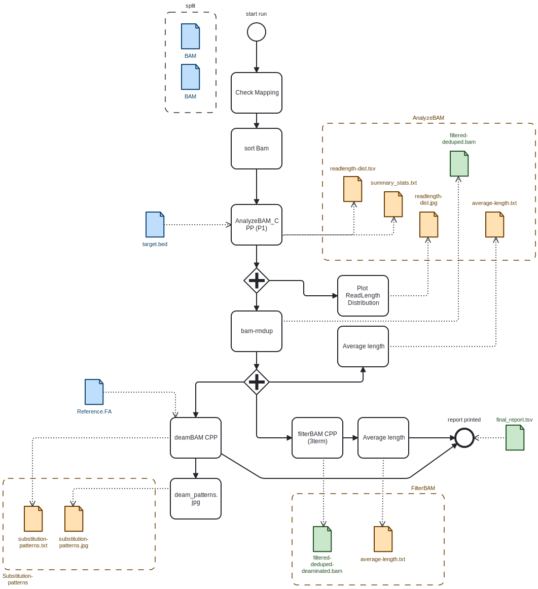

# Ancient DNA postprocessing pipeline (Human)

A nextflow pipeline for the basic post-processing of human shotgun or capture libraries (_not_ metagenomics samples). See the overview below for the workflow.

## Prerequisites

The pipeline runs with 

- [Nextflow](https://www.nextflow.io/docs/latest/getstarted.html) v22.10 or larger
- [Singularity](https://sylabs.io/singularity/) or [Docker](https://www.docker.com/)

**Note:** To run nextflow+singularity, your kernel needs to support user-namespaces (see [here](https://github.com/apptainer/singularity/issues/5240#issuecomment-618405898) or [here](https://github.com/apptainer/singularity/issues/6341)).
**NOTE**: The pipeline is configured to work within the computational environment of the Max-Planck-Institute for Evolutionary Anthropology.

## WARNING

**Do not** use version v0.5, as it contains a critical bug! Use version v0.6 or later!

## RUN

```
NXF_VER=24.04.4
nextflow run mpieva/postprocessing -r v0.6 --split SPLIT -profile PROFILE [OPTIONS]
```
use the `-r v0.6` flag to run a specific version of the pipeline

### SPLIT

The pipeline starts with a **directory** of already demultiplexed and mapped BAM-files, provided with the `--split` flag. Unmapped and unmerged paired sequences are **removed** in the analyzeBAM step. 


### OPTIONS

```
--help                                             Display the HELP Text
--split                        PATH     [required] A directory with demultiplexed and mapped BAM-files
                                                   (mapped to the genome specified in --reference_file)
--reference_file               FASTA    [required] Reference genome used for mapping, required for 'samtools calmd'
--reference_name               NAME     [required] The folder/name of the reference in '/mnt/solexa/Genomes/' (e.g. hg19_evan).
                                                   Used for naming output files and for double-checking the bam-header 
--target_file                  BED      [optional] Targetfile (BED) for subsetting BAM to 'ontarget' sequences
--target_name                  NAME     [optional] Name of the target for naming output-files (default: shotgun)

--bamfilter_minlength          N        [optional] Minimum length of retained sequences (default: 35)
--bamfilter_minqual            N        [optional] Minimum mapping quality of retained sequences (default: 25)
--bamfilter_keep_vendorfail             [optional] Keep reads in bamfile that have the "vendor failed" flag

--bamrmdup_cheap                        [optional] Bam-rmdup 'cheap' computation: skip the consensus calling
--bamrmdup_circular            CHR:LEN  [optional] Bam-rmdup 'circular' option - CHR is circular with length LEN
```

### PROFILES

Profiles can be set with the `-profile` flag (only one dash!!). They preserve parameters (target-file and references) for different common analyses.

The follwing **profiles** are available

```
shotgun {
  reference_file = "/mnt/solexa/Genomes/hg19_evan/whole_genome.fa"
  reference_name = "hg19_evan"
  target_name    = "shotgun"
  target_file    = false
}
AA108_AA115_archaicAdmixture {
  // Reference: Fu et al, 2015 (An early modern human from Romania with a recent Neanderthal ancestor), Panel 4
  reference_file = "/mnt/solexa/Genomes/hg19_evan/whole_genome.fa"
  reference_name = "hg19_evan"
  target_name    = "AA108_AA115_archaicAdmixture"
  target_file    = "/home/public/AncientDNA/probe_designs/AA108-115_archaic_admixture/Archaic.align.noN.sorted.bed"
}
AA213_1240k {
  // Reference: Fu et al, 2015 (An early modern human from Romania with a recent Neanderthal ancestor), Panel 1+2
  reference_file = "/mnt/solexa/Genomes/hg19_evan/whole_genome.fa"
  reference_name = "hg19_evan"
  target_name    = "AA213_1240k"
  target_file    = "/mnt/archgen/Reference_Genomes/Human/hs37d5/SNPCapBEDs/1240K.pos.list_hs37d5.0based.bed"
}
Twist_1240k {
  // Reference: Roland et al, 2022 (Three assays for in-solution enrichment of ancient human DNA at more than a million SNP)
  reference_file = "/mnt/solexa/Genomes/hg19_evan/whole_genome.fa"
  reference_name = "hg19_evan"
  target_name = "Twist_1240k"
  target_file = "/home/public/AncientDNA/probe_designs/TW1_Reich_Panel/gs01.target_positions_hg19.bed"
}
```

## Pipeline Overview



## Contributions

- [Mateja Hajdinjak](https://orcid.org/0000-0002-4064-0331)
- [Matthias Meyer](https://orcid.org/0000-0002-4760-558X)
- [Yaniv Schwiel](https://github.com/yanivsw/)

