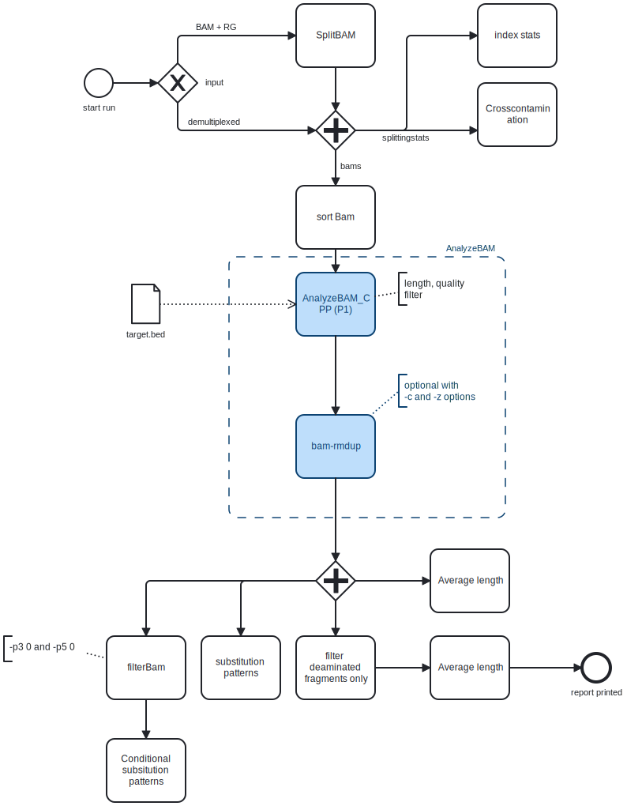

## Ancient DNA preprocessing pipeline

This is a pipeline for the initial processing of sequencing runs that are _not_ metagenomics samples.

The files should be already mapped to the human genome!

### Workflow

The first version of the Shotgun Sequencing pipeline follows Matejas Labfolder Entry

#### Preprocessing

- The run was mapped to `hg19_evan` with aDNA parameters
- adapters were trimmed with `leeHom`.

#### Pipeline



#### Run the pipeline

```
nextflow run /mnt/scratch/merlin/software/run_postprocessing_pipeline/main.nf --split SPLIT

```

#### Default filters

- minimum-length: 35
- minimum-quality: 25
- Only mapped
- Only merged
- Vendor OK (Illumina)
- Mapping to X,Y or Autosome

#### Contributions

- Mateja (Outline of pipeline, AverageLength)
- Yaniv (AnalyzeBam)
- Matthias (AnalyzeBam, FilterBam, SplitBAM)
